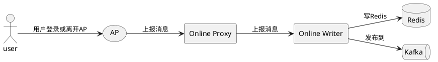
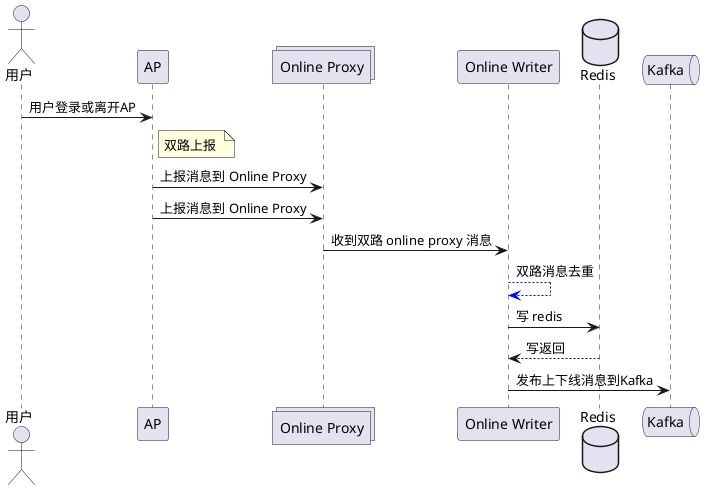
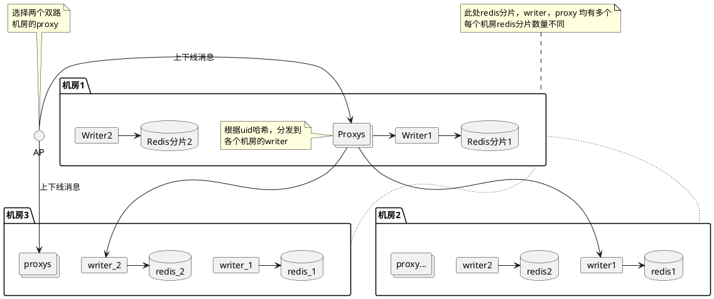
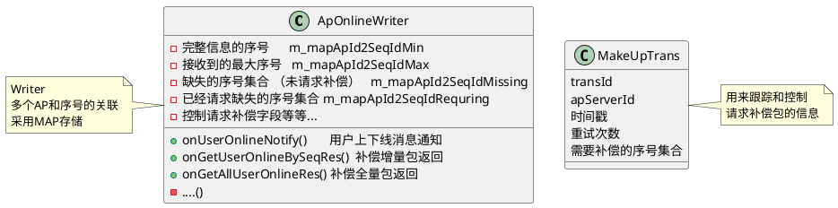
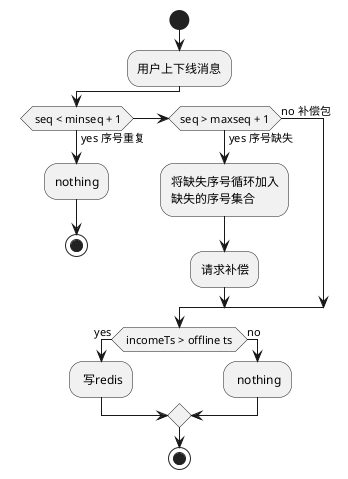
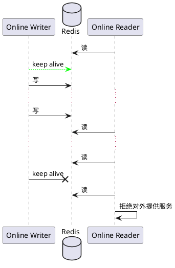

## 单播简要处理流程
***
### 单播下发流程
 (api gateway); 
(api gateway) --> (单播);  
(单播) --> (ap); 
(ap) --> user;
@enduml
'>

* `ucs` 为单播服务
* `online reader`为`apOnline系统`对外提供的用户在线信息查询接口
  
 "api gateway" : 请求;
"api gateway" -> UCS :单播请求;
UCS -> "Online Reader": 查询ap在线信息;
"Online Reader"-> Redis :读 Redis;
Redis-->"Online Reader" :返回在线的ap列表;
"Online Reader"-->UCS:返回;
UCS -> AP:单播到对应ap;
actor user;
AP -> user;
@enduml
'>
***

 (单播进程1);
(sdk) --> (单播进程2); 
note left of sdk;
    发双路单播消息(serverId + seqId);
    到同机房以及另外机房的单播进程;
end note;
(单播进程1) --> (ap);
(单播进程2) --> (ap); 
note left of ap;
ap  去重;
end note;
ap -> 用户;
@enduml
'>


## ap在线系统
 ap在线系统保持用户的在线信息，可理解为保持了用户的session信息 
* Online proxy 将 ap 上报的用户上下线消息 分发到每个机房 对应的 writer 分片
* Online writer分片与 redis 分片一一对应 ,负责对 redis 的写操作
* redis 存储用户在线的信息
  




## 部署
```
   各个机房互为镜像，每个机房存储了全部的ap在线信息
   Online proxy 将 ap 上报的用户上下线消息 分发到每个机房 对应的 writer 分片
   Online writer 采用配置中心固定配置，保证一致性哈希的确定性
   Online writer 分片 与 redis 分片一一对应
   Online reader 通过uid % redis count 查询对应的redis分片
```



##### Writer简要处理机制


<!-- // class UserMark {
// 	{field}  时间戳   
//    {field}  apServerId   
//    {field}  序号
// } -->


* writer 接收到 ap aproxy 的时候或触发
* writer内部还设有定时器,定时检查缺失的序号并请求补偿
* MakeUpTrans 主要用来记录请求补偿信息 


####  Redis故障或者Online Reader故障，通过业务服务发现业务会自行切换




 ### 思考
 * proxy ,reader，ucs均可横向扩展
 * 写压力最终会压到writer和redis (应该不用考虑)，用户上下线信息由于会短暂聚合，不会对写进程造成压力  
********* 
