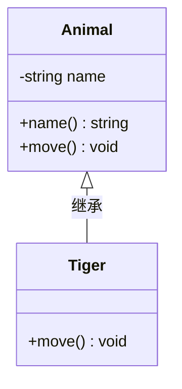

在UML类图中，常见的有以下几种关系: 泛化（Generalization）,  实现（Realization），关联（Association)，聚合（Aggregation），组合(Composition)，依赖(Dependency)

## 1. 泛化（Generalization）

【泛化关系】：是一种继承关系，表示一般与特殊的关系，它指定了子类如何特化父类的所有特征和行为。例如：老虎是动物的一种，即有老虎的特性也有动物的共性。

        【箭头指向】：带三角箭头的实线，箭头指向父类
        

## 参考

* [UML类图几种关系的总结](https://www.open-open.com/lib/view/open1328059700311.html)
* [使用Mermaid语法画UML类图](https://www.cnblogs.com/mybdss/p/14958781.html])
